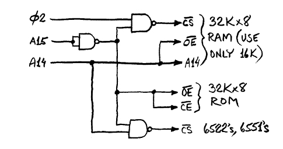
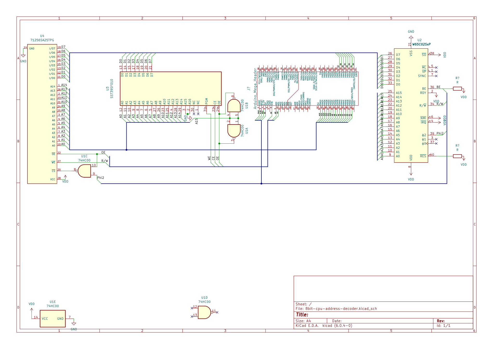

# tools for 6502 8 bit computer

## requirements
* cc65
* platformio

## Arduino mega 2560 connections
See [pins.h](include/pins.h) and the [Datasheet](https://www.westerndesigncenter.com/wdc/documentation/w65c02s.pdf)

| Pin | Connect to | Function                                                  |
|-----|------------|-----------------------------------------------------------|
| 2   | CPU Phi2   | Clock                                                     |
| 3   | CPU RW     | Indicates bus read/write by CPU  HIGH=read, LOW=write |
| 4   | CPU Reset  | When low for 2 clock cycles, resets CPU                   |
| 5   | CPU BE     | When set to low, decouples the CPU from the bus           |
| 8   | eeprom OE  | When low, enables the output on the eeprom                |
| 9   | eeprom WE  | When low, enables writing on the eeprom                   |
| 10  | eeprom CE  | When low, enables the eeprom                              |
| 53  | CPU A15    |                                                           |
| 51  | CPU A14    |                                                           |
| 49  | CPU A13    |                                                           |
| 47  | CPU A12    |                                                           |
| 45  | CPU A11    |                                                           |
| 43  | CPU A10    |                                                           |
| 41  | CPU A9     |                                                           |
| 39  | CPU A8     |                                                           |
| 37  | CPU A7     |                                                           |
| 35  | CPU A6     |                                                           |
| 33  | CPU A5     |                                                           |
| 31  | CPU A4     |                                                           |
| 29  | CPU A3     |                                                           |
| 27  | CPU A2     |                                                           |
| 25  | CPU A1     |                                                           |
| 23  | CPU A0     |                                                           |
| 38  | CPU D7     |                                                           |
| 40  | CPU D6     |                                                           |
| 42  | CPU D5     |                                                           |
| 44  | CPU D4     |                                                           |
| 46  | CPU D3     |                                                           |
| 48  | CPU D2     |                                                           |
| 50  | CPU D1     |                                                           |
| 52  | CPU D0     |                                                           |

## Memory map
http://wilsonminesco.com/6502primer/addr_decoding.html

| start | end  | what     |
|-------|------|----------|
| 0000  | 3FFF | RAM      |
| 4100  |      | ACIA 3-1 |
| 4104  |      | ACIA 3-2 |
| 4108  |      | ACIA 3-3 |
| 410C  |      | ACIA 3-4 |
| 4200  |      | ACIA 2-1 |
| 4204  |      | ACIA 2-2 |
| 4208  |      | ACIA 2-3 |
| 420C  |      | ACIA 2-4 |
| 4400  | 4403 | ACIA 1   |
| 4800  | 480F | VIA 3    |
| 5000  | 500F | VIA 2    |
| 6000  | 600F | VIA 1    |
| 8000  | FFFF | ROM      |

## Bus

| Port | Use   |
|------|-------|
| 1    | VSS   |
| 2    | X     |
| 3    | X     |
| 4    | VDD   |
| 5    | A0    |
| 6    | A1    |
| 7    | A2    |
| 8    | A3    |
| 9    | A4    |
| 10   | A5    |
| 11   | A6    |
| 12   | A7    |
| 13   | A8    |
| 14   | A9    |
| 15   | A10   |
| 16   | A11   |
| 17   | A12   |
| 18   | A13   |
| 19   | A14   |
| 20   | A15   |
| 21   | D0    |
| 22   | D1    |
| 23   | D2    |
| 24   | D3    |
| 25   | D4    |
| 26   | D5    |
| 27   | D6    |
| 28   | D7    |
| 29   | R/W   |
| 30   | phi 2 |
| 31   | phi 1 |
| 32   | IRQ   |
| 33   | NMI   |
| 34   | RES   |
| 35   | X     |
| 36   | X     |
| 37   | VDD   |
| 38   | X     |
| 39   | X     |
| 40   | VSS   |

## Schematic
