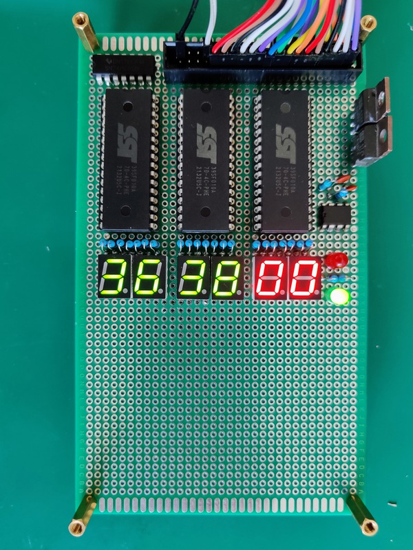
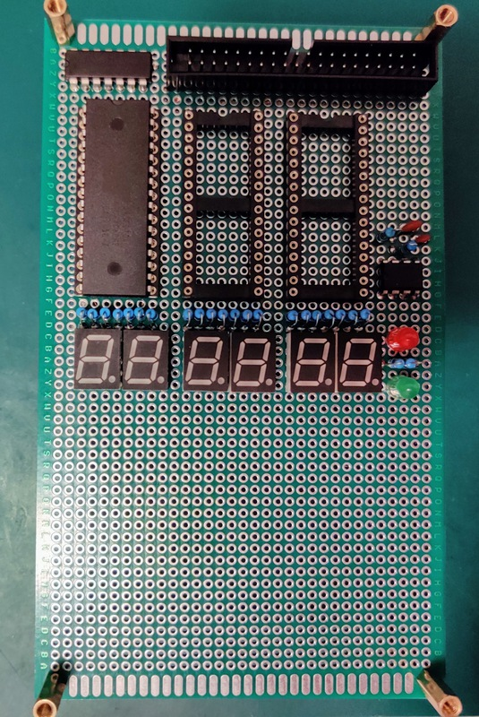

# Build log
Of course, I started this way too late. 

# 20220418
Managed to get the bus display board working!

After some troubleshooting, I figured out that I overlooked something.
Both the `555` timer IC and the `74hc00` NAND IC, can not sink enough current for all the LED segments!
The timer even sinks less than the NAND, as it's more dim.
Since I supply power to the LEDs from the EEPROM data ports, 
it ever occurred to me that all that current needs to actually go somewhere.
After going through my (limited) supply of parts, in my junk box, I found some `BD652` PNP power transistors.
I have no clue where I got these and when, but they seem to do the job just fine.
I soldered the rest of the segment displays, resistors and IC sockets,
and tested the board with all segments lit. It looks nice and bright (enough).
A bit of soldering later, the board was finished.

# 20220417
Refactored this whole repo, to give it more structure.

### Bus display board
After redoing some solder joints, the timer is outputting square waves again.
It does seem the `555` IC can't provide enough current for the led segments of 2 displays.
The `NAND` can, though. I soldered the rest of the segment displays and resistors to the board.
Next I will test if the NAND can provide enough current. 
If so, I'll chain two gates together to power the right side displays, instead of the `555` timer.

# 20220416
I soldered the first 2 displays + control logic for the bus-display.
This should allow me to test it and fix errors before I put the rest on the board.
The displays seem to work, the eeprom seems to be connected correctly (I can produce the different outputs).
When I let it display `F0` for example, the segments in the `0` that are different from the `F`, are not fully lit.
When checking the 555 timer output, and the NAND inversion of that output, 
I found that the 555 timer doesn't produce a square wave anymore. It did do that on the breadboard, 
so I probably either broke something or made a mistake. 
Of course I didn't solder an IC socket for the 555, as I didn't have any with 8 pins anymore...
To be investigated...

# 20220407-ish

The final ROM board.

On the left are the pins for `CE`, `OE`, `WE`, and the switches to attach them to the bus.
The leds show the state of the three signals, from top to bottom.
The `74HC00` has 4 NAND ports, used to control the `CE` and `OE` signals, 
so the EEPROM only responds for 0x8000 - 0xFFFF.
The connector on the top is the bus, which connects the board to the CPU.