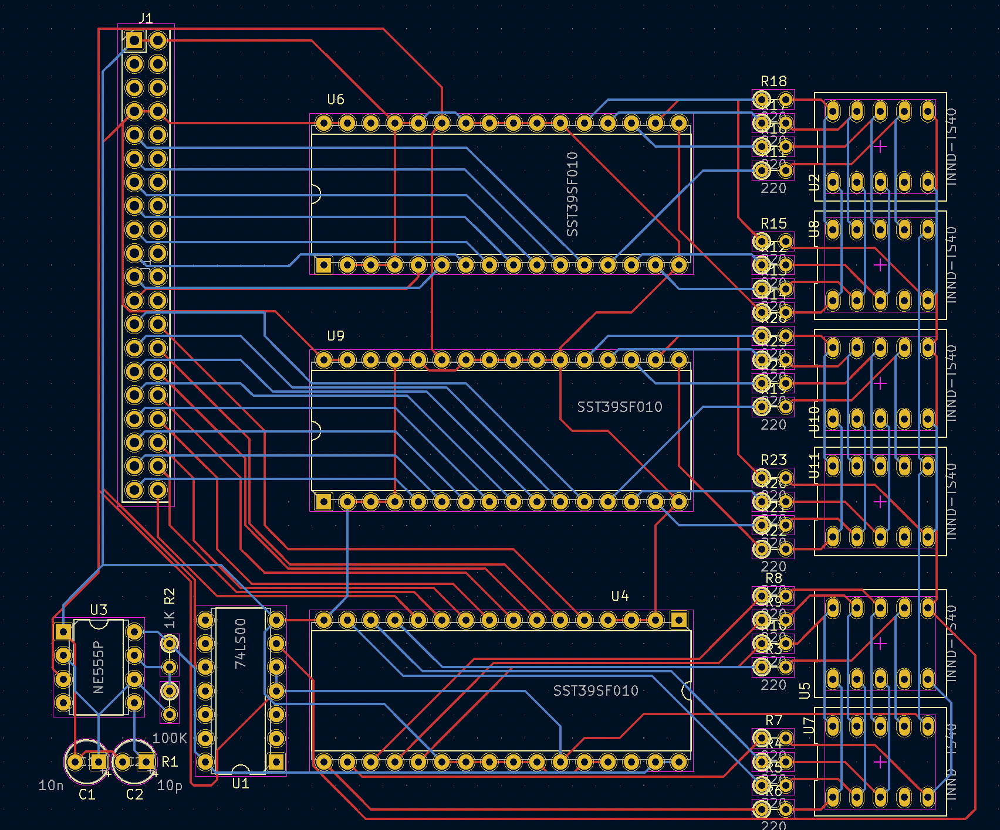

# Address display
Shows both the address bus and data bus signals as HEX.

## Schema

## Bugs / todo
* a NAND is used to invert the clock signal, which delays it a little, causing one of the display to ghost the other
* the PCB is horrible
* The timer seems to not work properly, while it did work on the breadboard. It's not producing a square wave
