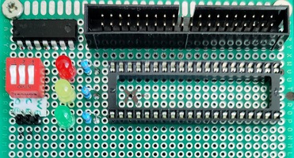

## 20220407-ish

The final ROM board.

On the left are the pins for `CE`, `OE`, `WE`, and the switches to attach them to the bus.
The leds show the state of the three signals, from top to bottom.
The `74HC00` has 4 NAND ports, used to control the `CE` and `OE` signals,
so the EEPROM only responds for 0x8000 - 0xFFFF.
The connector on the top is the bus, which connects the board to the CPU.

