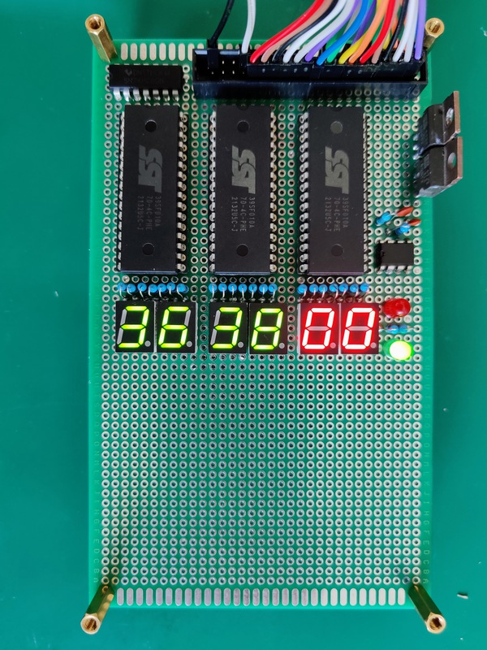

# Address display
This board helps with debugging in single step mode.
But I mostly created it for the [blinkenlights](https://en.wikipedia.org/wiki/Blinkenlights) factor.
It shows the values on the address, and data busses, and the state of the R/<INS>W</INS> line.

The schematic can be found [here](https://github.com/hsmade/8bit-computer/tree/master/bus-display/kicad/).

