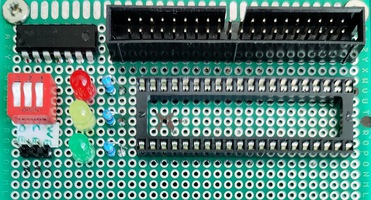

# ROM / programmer card
This card holds the rom, and exposes a pin header for programming.
I currently do the programming with an Arduino Mega (because I need a lot of IO ports).
The software for programming the eeprom can be found [here](rom-programmer.md).
THe Arduino mega board fits right on the bus connector, it just needs a jumper wire for GND,
and jumper wires for `CE`, `WE`, and `OE`.

The schematic can be found [here](https://github.com/hsmade/8bit-computer/tree/master/ROM/kicad/).

