# Modular Wall-Computer

## Cards

- [ACIA Card](#acia-card)
- [Backplane Card](#backplane-card)
- [Base Card](#base-card)
- [Bus Display Card](#bus-display-card)
- [Clock Card](#clock-card)
- [CPU Card](#cpu-card)
- [Memory Card](#memory-card)
- [Power Card](#power-card)
- [VIA Card](#via-card)

## ACIA Card

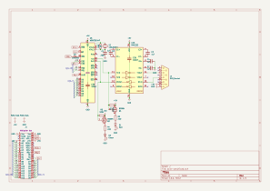

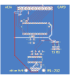

## Backplane Card

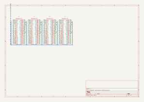

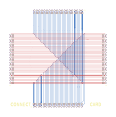

## Base Card

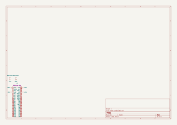

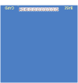

## Bus Display Card

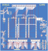

## Clock Card

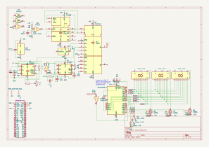

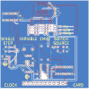

## CPU Card

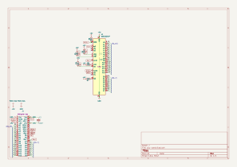

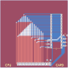

## Memory Card

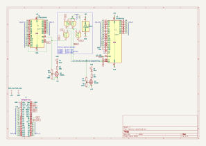

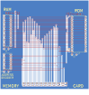

## Power Card

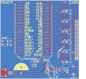

## VIA Card

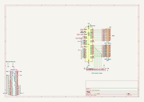

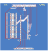
